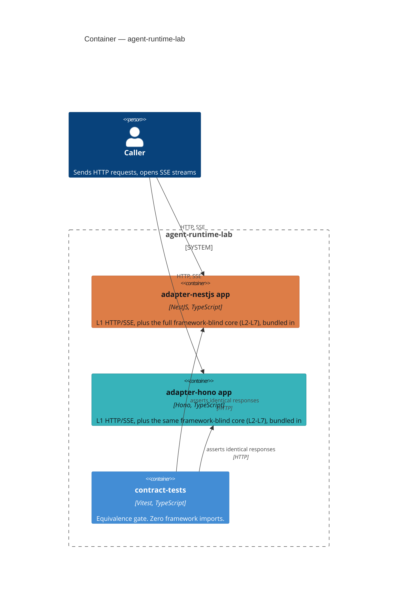
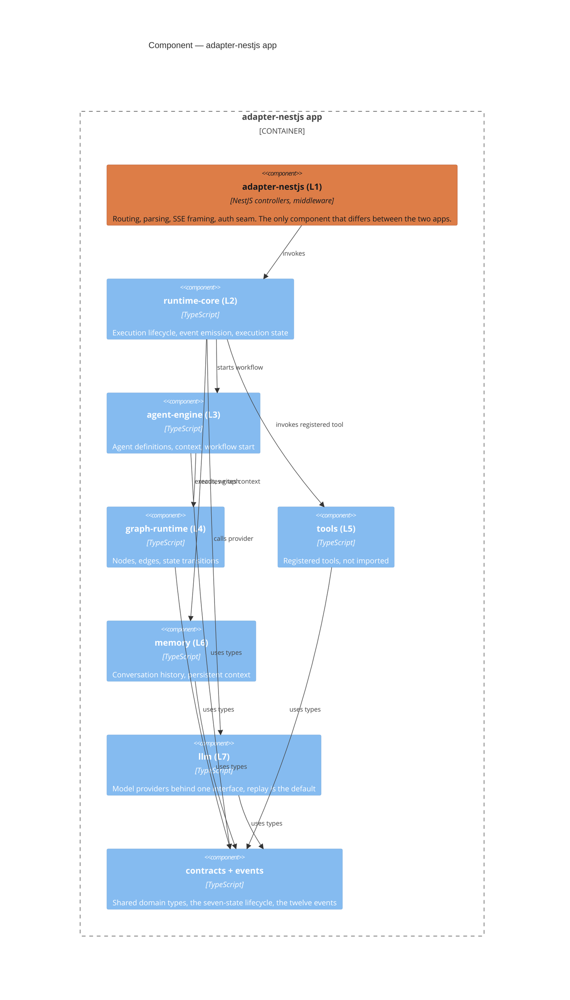
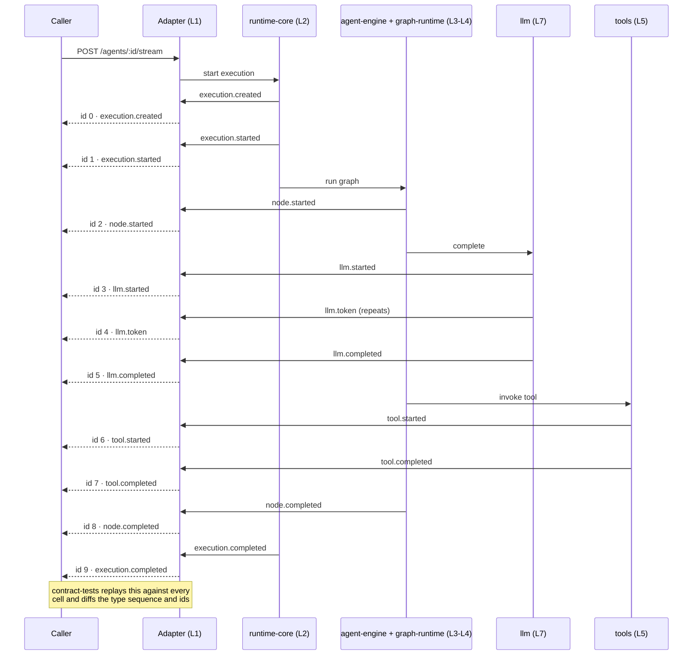

# Architecture

Diagrams for the shape described in [README.md](README.md): two deployable
apps built from the same core, and the one request path that has to look
identical no matter which app served it.

C4 model, container and component levels, plus a sequence diagram for the
one request path the whole project rests on.

## Container: what's actually deployed

A "container" here is a separately runnable thing, not a Docker container
specifically (`docker-compose.yml` happens to give each one its own, but
that's a deployment detail, not this diagram). There are two: an app built
around `adapter-nestjs`, and an app built around `adapter-hono`. Both bundle
the exact same L2-L7 core.

Each of these two containers deploys twice, once per JS runtime (Node, Bun),
for four cells total. The runtime is a deployment-time choice, not a
different container, it never shows up as a box here. The matrix in the
README is where that axis lives.

## Component: inside one app

Zoomed into `adapter-nestjs app`. `adapter-hono app` has the identical
picture below L1, its L1 component is the only thing that differs, everything
from `runtime-core` down is the same source in both containers.

L1 carries the accent color because it is the one component allowed to vary.
L2-L7 stay unstyled because none of them may contain agent logic, prompts,
workflow definitions, or tool implementations that differ by framework, that
constraint is what makes the two apps' behavior comparable at all.

## Sequence: one streamed execution

`POST /agents/:id/stream`, one representative run: a node that calls a
provider, then a tool, then completes. Event types and ordering are read
directly from `packages/events/src/event-type.ts`; `contract-tests` asserts
this exact type sequence, and monotonically increasing SSE ids
(`sse.event.id.monotonic`), on every cell.

A run that errors mid-stream does not drop to an HTTP status, it arrives as
an `execution.failed` event on the same stream
(`error.midstream.is.event.not.status`, also asserted by `contract-tests`).
